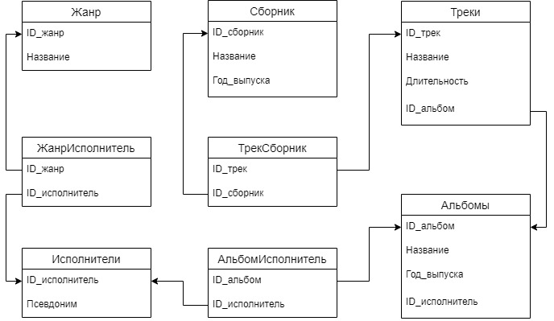

# Решение домашнего задания к лекции «Работа с SQL. Создание БД»
## Задание 1
### Дано
_Спроектировать и нарисовать схему, как в первой домашней работе. Прислать изображение со схемой._
### Решение


## Задание 2
### Дано
_Написать SQL-запросы, создающие спроектированную БД. Прислать ссылку на файл, содержащий SQL-запросы._
### Решение
```sql
CREATE TABLE IF NOT EXISTS genre (
	id serial PRIMARY KEY,
	genre_name varchar(100) NOT NULL
);
CREATE TABLE IF NOT EXISTS artist (
	id serial PRIMARY KEY,
	artist_name varchar(100) NOT NULL	
);
CREATE TABLE IF NOT EXISTS genre_artist (
    genre_id integer REFERENCES genre(id),
    artist_id integer REFERENCES artist(id),
    CONSTRAINT genre_artist_pk PRIMARY KEY (genre_id, artist_id)
);
CREATE TABLE IF NOT EXISTS album (
	id serial PRIMARY KEY,
	album_name varchar(100) NOT NULL,
	year_of_release integer NOT NULL
);
CREATE TABLE IF NOT EXISTS album_artist (
	album_id integer REFERENCES album(id),
    artist_id integer REFERENCES artist(id),
    CONSTRAINT artist_album_pk PRIMARY KEY (artist_id, album_id)
);
CREATE TABLE IF NOT EXISTS track (
	id serial PRIMARY KEY,
	track_name varchar(100) NOT NULL,
	duration integer NOT NULL,
	album_id integer REFERENCES album(id)
);
CREATE TABLE IF NOT EXISTS collection (
    id serial PRIMARY KEY,
    collection_name varchar(100) NOT NULL,
    year_of_release integer NOT NULL
);
CREATE TABLE IF NOT EXISTS track_collection (
    track_id integer REFERENCES track(id),
    collection_id integer REFERENCES collection(id),
    CONSTRAINT track_collection_pk PRIMARY KEY (track_id, collection_id)
);
```
По средствам запуска скрипта в DBeaver, создались все таблицы:

